<div align=center></div>

[](#)
[](#) 
[](https://cocoapods.org/pods/JXSegmentedView)
[](#) 

[There is an English document here, click to view](https://github.com/pujiaxin33/JXSegmentedView/blob/master/README-English.md)

A powerful and easy to use segmented view (segmentedcontrol, pagingview, pagerview, pagecontrol, categoryview) (腾讯新闻、今日头条、QQ音乐、网易云音乐、京东、爱奇艺、腾讯视频、淘宝、天猫、简书、微博等所有主流APP分类切换滚动视图)

与其他的同类三方库对比的优点：
- 指示器逻辑面向协议编程(Protocol Oriented Programming)，可以为所欲为的扩展指示器效果；
- 提供更加全面丰富效果，几乎支持所有主流APP效果；
- 使用子类化管理cell样式，逻辑更清晰，扩展更简单；

## Objective-C版本

如果你在找Objective-C版本，请点击查看
[JXCategoryView](https://github.com/pujiaxin33/JXCategoryView)

## 效果预览

### 指示器效果预览

说明 | Gif |
----|------|
Line固定宽度  |  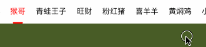 |
Line与cell等宽  |  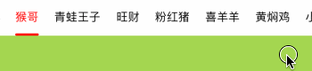 |
Line延长  |  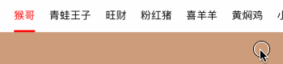 |
Line延长+偏移  |   |
RainbowLine🌈彩虹  |  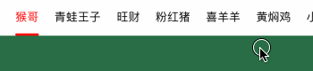 |
DotLine点线 |  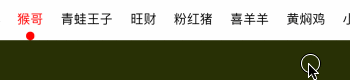 |
DoubleLine双线  |   |
Triangle三角形底部  |   |
Triangle三角形顶部  |   |
Background椭圆形  |  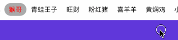 |
Background椭圆形+阴影  |   |
Background遮罩有背景  |  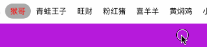 |
Background遮罩无背景  |   |
Background渐变色<br>(渐变是固定的)  |   |
Gradient渐变色<br>(渐变随着位置变动)  |  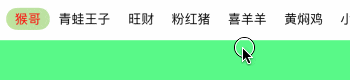 |
Image底部  |  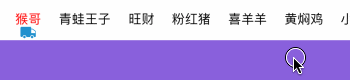 |
Image背景  |   |
混合使用 |   |

以下指示器支持上下位置切换：
`JXSegmentedIndicatorLineView`、`JXSegmentedIndicatorRainbowLineView`、`JXSegmentedIndicatorDotLineView`、`JXSegmentedIndicatorDoubleLineView`、`JXSegmentedIndicatorTriangleView`、`JXSegmentedIndicatorImageView`

### Cell样式效果预览

说明 | Gif |
----|------|
颜色渐变  |  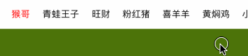 |
文字渐变  |   |
大小缩放  |   |
大小缩放+字体粗细  |  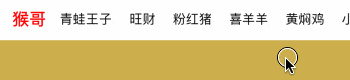 |
大小缩放+点击动画  |   |
大小缩放+cell宽度缩放  |  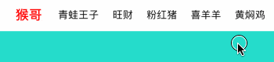 |
TitleImage_Top |   |
TitleImage_Left |   |
TitleImage_Bottom |  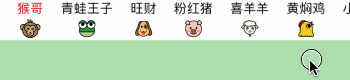 |
TitleImage_Right |  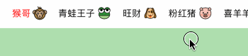 |
TitleImage_只有图片 |   |
TitleOrImage(高仿腾讯视频) |   |
数字 |   |
红点 |  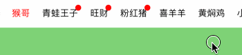 |
多行富文本 |   |
多种cell混用 |   |

### 特殊效果预览

说明 | Gif |
----|------|
数据源过少<br/> isItemSpacingAverageEnabled为true |   |
数据源过少<br/> isItemSpacingAverageEnabled为false |  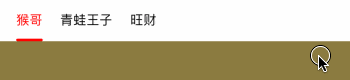 |
SegmentedControl<br/>参考[`SegmentedControlViewController`](https://github.com/pujiaxin33/JXSegmentedView/blob/master/Example/JXSegmentedViewExample/Special/SegmentedControl/SegmentedControlViewController.swift)类 |   |
导航栏使用<br/>参考[`NaviSegmentedControlViewController`](https://github.com/pujiaxin33/JXSegmentedView/blob/master/Example/JXSegmentedViewExample/Special/SegmentedControl/NaviSegmentedControlViewController.swift)类 |  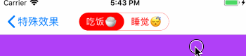 |
嵌套使用<br/>参考[`NestViewController`](https://github.com/pujiaxin33/JXSegmentedView/blob/master/Example/JXSegmentedViewExample/Special/Nest/NestViewController.swift)类 |   |
个人主页(上下左右滚动、header悬浮)<br/>参考[`PagingViewController`](https://github.com/pujiaxin33/JXSegmentedView/blob/master/Example/JXSegmentedViewExample/Special/Personal/PagingViewController.swift)类<br/> 更多样式请点击查看[JXPagingView库](https://github.com/pujiaxin33/JXPagingView) |  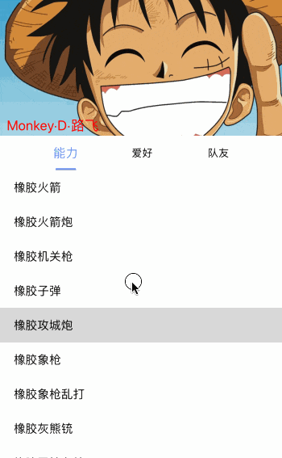 |
数据加载&刷新<br/>参考[`LoadDataViewController`](https://github.com/pujiaxin33/JXSegmentedView/blob/master/Example/JXSegmentedViewExample/Special/LoadData/WithListContainerView/LoadDataViewController.swift)类 |   |


## 要求

- iOS 8.0+
- Xcode 9+
- Swift 4.2、5.0

## 安装

### 手动

Clone代码，把Sources文件夹拖入项目，就可以使用了；

### CocoaPods

```ruby
target '<Your Target Name>' do
    pod 'JXSegmentedView'
end
```
先执行`pod repo update`，再执行`pod install`

### Carthage
在cartfile文件添加：
```
github "pujiaxin33/JXSegmentedView"
```
然后执行`carthage update --platform iOS` 即可

## 使用

### `JXSegmentedView`使用示例

1.初始化JXSegmentedView
```Swift
self.segmentedView = JXSegmentedView()
self.delegate = self
self.view.addSubview(self.segmentedView)
```

2.初始化dataSource

`dataSouce`类型为`JXSegmentedViewDataSource`协议。使用单独的类实现`JXSegmentedViewDataSource`协议，实现代码隔离。选择不同的类赋值给`dataSource`，就可以控制`JXSegmentedView`显示效果，实现插件化。比如选择`JXSegmentedTitleImageDataSource`类作为`dataSource`就选择了文字图片的显示效果；选择`JXSegmentedNumberDataSource`类作为`dataSource`就选择了文字加数字的显示效果；
```Swift
//segmentedDataSource一定要通过属性强持有，不然会被释放掉
self.segmentedDataSource = JXSegmentedTitleDataSource()
//配置数据源相关配置属性
self.segmentedDataSource.titles = ["猴哥", "青蛙王子", "旺财"]
self.segmentedDataSource.isTitleColorGradientEnabled = true
//reloadData(selectedIndex:)方法一定要调用，方法内部会刷新数据源数组
self.segmentedDataSource.reloadData(selectedIndex: 0)
//关联dataSource
self.segmentedView.dataSource = self.segmentedDataSource
```

3.初始化指示器indicator
```Swift
let indicator = JXSegmentedIndicatorLineView()
indicator.indicatorWidth = 20
self.segmentedView.indicators = [indicator]
```

4.实现`JXSegmentedViewDelegate`代理
```Swift
//点击选中或者滚动选中都会调用该方法。适用于只关心选中事件，而不关心具体是点击还是滚动选中的情况。
func segmentedView(_ segmentedView: JXSegmentedView, didSelectedItemAt index: Int) {}

// 点击选中的情况才会调用该方法
func segmentedView(_ segmentedView: JXSegmentedView, didClickSelectedItemAt index: Int) {}

// 滚动选中的情况才会调用该方法
func segmentedView(_ segmentedView: JXSegmentedView, didScrollSelectedItemAt index: Int) {}

// 正在滚动中的回调
func segmentedView(_ segmentedView: JXSegmentedView, scrollingFrom leftIndex: Int, to rightIndex: Int, percent: CGFloat) {}
```

### `contentScrollView`列表容器使用示例

#### 直接使用`UIScrollView`自定义使用示例

因为代码比较分散，而且代码量也比较多，所有不推荐使用该方法。要正确使用需要注意的地方比较多，尤其对于刚接触iOS的同学来说不太友好。

不直接贴代码了，具体点击[LoadDataCustomViewController](https://github.com/pujiaxin33/JXSegmentedView/blob/master/Example/JXSegmentedViewExample/Special/LoadData/ListCustom/LoadDataCustomViewController.swift)查看源代码了解。

作为替代，官方使用&强烈推荐使用下面这种方式👇👇👇。

#### 配合`JXSegmentedListContainerView`封装类使用示例

`JXSegmentedListContainerView`是对列表视图高度封装的类，具有以下优点：
- 相对于直接使用`UIScrollView`自定义，封装度高、代码集中、使用简单；
- 列表懒加载：当显示某个列表的时候，才进行列表初始化。而不是一次性加载全部列表，性能更优；

1.初始化`JXSegmentedListContainerView`
```Swift
self.listContainerView = JXSegmentedListContainerView(dataSource: self)
self.view.addSubview(self.listContainerView)
//关联cotentScrollView，关联之后才可以互相联动！！！
self.segmentedView.contentScrollView = self.listContainerView.scrollView
```

2.实现`JXSegmentedListContainerViewDataSource`代理方法
```Swift
//返回列表的数量
func numberOfLists(in listContainerView: JXSegmentedListContainerView) -> Int {
    return self.segmentedDataSource.titles.count
}
//返回遵从`JXSegmentedListContainerViewListDelegate`协议的实例
func listContainerView(_ listContainerView: JXSegmentedListContainerView, initListAt index: Int) -> JXSegmentedListContainerViewListDelegate {
    return ListBaseViewController()
}
```

3.列表实现`JXSegmentedListContainerViewListDelegate`代理方法

不管列表是UIView还是UIViewController都可以，提高使用灵活性，更便于现有的业务接入。
```Swift
/// 如果列表是VC，就返回VC.view
/// 如果列表是View，就返回View自己
/// - Returns: 返回列表视图
func listView() -> UIView {
    return view
}

//可选使用，列表显示的时候调用
func listDidAppear() {}

//可选使用，列表消失的时候调用
func listDidDisappear() {}
```

4.将关键事件告知`JXSegmentedListContainerView`

在下面两个`JXSegmentedViewDelegate`代理方法里面调用对应的代码，一定不要忘记这一条❗️❗️❗️
```Swift
func segmentedView(_ segmentedView: JXSegmentedView, didClickSelectedItemAt index: Int) {
    //传递didClickSelectedItemAt事件给listContainerView，必须调用！！！
    listContainerView.didClickSelectedItem(at: index)
}

func segmentedView(_ segmentedView: JXSegmentedView, scrollingFrom leftIndex: Int, to rightIndex: Int, percent: CGFloat) {
    //传递scrolling事件给listContainerView，必须调用！！！
    listContainerView.segmentedViewScrolling(from: leftIndex, to: rightIndex, percent: percent, selectedIndex: segmentedView.selectedIndex)
}
```

具体点击[LoadDataViewController](https://github.com/pujiaxin33/JXSegmentedView/blob/master/Example/JXSegmentedViewExample/Special/LoadData/WithListContainerView/LoadDataViewController.swift)查看源代码了解

### 使用总结

因为`JXSegmentedView`本身支持许多特性：指示器、cell样式、列表容器等，如何有序管理好代码成了一个难题。借助于协议、继承、封装类极大的简化了使用难度，而且提高了灵活性，扩展相当容易。

- 核心主类：`JXSegmentedView`
- 数据源&cell样式定制类：遵从`JXSegmentedViewDataSource`协议的类
- 指示器类：遵从`JXSegmentedIndicatorProtocol`协议的`UIView`类
- 列表容器：官方推荐`JXSegmentedListContainerView`类，特殊情况可以使用`UIScrollView`自定义

## 指示器样式自定义

- 需要继承`JXSegmentedIndicatorProtocol`协议，点击参看[JXSegmentedIndicatorProtocol](https://github.com/pujiaxin33/JXSegmentedView/blob/master/Sources/Indicator/JXSegmentedIndicatorProtocol.swift)
- 提供了继承`JXSegmentedIndicatorProtocol`协议的基类`JXSegmentedIndicatorBaseView`，里面提供了许多基础属性。点击参看[JXSegmentedIndicatorBaseView](https://github.com/pujiaxin33/JXSegmentedView/blob/master/Sources/Indicator/JXSegmentedIndicatorBaseView.swift)
- 自定义指示器，请参考已实现的指示器视图，多尝试、多思考，再有问题请提Issue或加入反馈QQ群


## dataSource和Cell自定义

- 需要继承`JXSegmentedViewDataSource`协议，点击参看[JXSegmentedViewDataSource](https://github.com/pujiaxin33/JXSegmentedView/blob/master/Sources/Core/JXSegmentedView.swift)
- 提供了继承`JXSegmentedViewDataSource`协议的基类`JXSegmentedBaseDataSource`，里面提供了许多基础属性。点击参看[JXSegmentedBaseDataSource](https://github.com/pujiaxin33/JXSegmentedView/blob/master/Sources/Core/JXSegmentedBaseDataSource.swift)
- 任何自定义需求，dataSource、cell、itemModel三个都要子类化。即使某个子类cell什么事情都不做。用于维护继承链，以免以后子类化都不知道要继承谁了；
- dataSource和Cell自定义，请参考已实现的dataSource，多尝试、多思考，再有问题请提Issue或加入反馈QQ群

## 常用属性说明

[常用属性说明文档地址](https://github.com/pujiaxin33/JXSegmentedView/blob/master/Document/%E5%B8%B8%E7%94%A8%E5%B1%9E%E6%80%A7%E8%AF%B4%E6%98%8E.md)

## 其他使用注意事项

[其他使用注意事项文档地址](https://github.com/pujiaxin33/JXSegmentedView/blob/master/Document/%E6%B3%A8%E6%84%8F%E4%BA%8B%E9%A1%B9.md)

## 补充

如果刚开始使用`JXSegmentedView`，当开发过程中需要支持某种特性时，请务必先搜索使用文档或者源代码。确认是否已经实现支持了想要的特性。请别不要文档和源代码都没有看，就直接提问，这对于大家都是一种时间浪费。如果没有支持想要的特性，欢迎提Issue讨论，或者自己实现提一个PullRequest。

该仓库保持及时更新，对于主流新的分类选择效果会第一时间支持。使用过程中，有任何建议或问题，可以通过以下方式联系我：</br>
邮箱：317437084@qq.com </br>
QQ群： 112440276


喜欢就star❤️一下吧

## License

JXSegmentedView is released under the MIT license.
